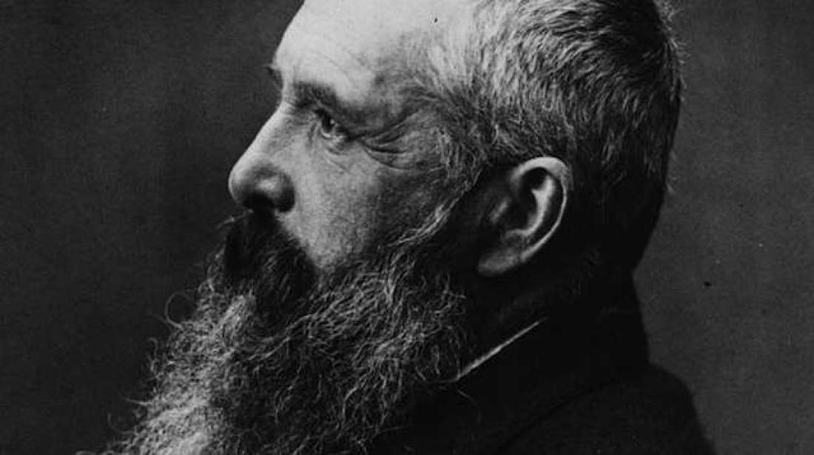

## Makefiles

In this part, there is what is called a ['makefile'](http://www.cs.colby.edu/maxwell/courses/tutorials/maketutor/). These are special files that have instructions on how to compile your programs. Make itself is a 'build system' that saves us time in typing out compilation commands (It also allows saves us from mistakes, making sure we type in the same compiler flags each time we run our program). Build systems may also have additional optimizations, such as only recompiling files that you have changed.

For this assignment:

* compile your program by typing in : `make` from the root directory. 

That is it! You can inspect the makefile to learn how to create your own makefiles for future assignments.

**Note:** Makefiles are particularly strict about using tabs instead of spaces to indent commands. If you make modifications and you get an error, the first thing to check is that your text editor is using tabs instead of spaces.

## Multiprocessing with Threads (Investigating the support code)



The artists from our previous exercise are frustrated! They did not believe they got to be creative enough in how they were constrained on painting on the previous canvas. 

> Artists: "We are very frustrated!"
>
> You: You calmly explain, "We were exploiting data parallelism, you had one whole row of pixels to draw on without interruption."
>
> You: "Did you not enjoy working so efficiently(without the use of locks) without intefering with the other artists?"
>
> Artists: "We did not! This time we want to use threads, locks, ... , whatever it takes for our masterpiece!"

The artists have spoken...for this assignment you will be be working with [posix threads](https://computing.llnl.gov/tutorials/pthreads/) to help them create a masterpiece. This time, you will start working with exactly four artists: Michaelangelo, Donatello, Rapheal, and Leonardo. These artists egos have grown out of control and they want to move around and paint in more directions on the canvas. And as we know when there is a shared resource we will have to coordinate the artists much more carefully using locks!

### Prompt/Specification

Michaelangelo, Rapheal, Donatello, and Leonardo are amongst the great artists who have been commissioned to paint on a shared 256x256 canvas. The canvas itself starts with RGB values of (255,255,255) on each pixel.  Read on for more specifications:

- 4 total artists will paint on one canvas (until we add more artists in the next part).
- Each artist wants to paint as much as possible, and they each start in their own corner.
- Artists are not allowed to 'jump' to different locations. They may only paint next to pixels that are white, or pixels that are the same brush color the artist has. 
		- Michaelangelo paints in orange: rgb(255,140,0)
		- Leonardo paints in blue: rgb(0,0,255)
		- Donatello paints in Purple: rgb(128,0,128)
		- Raphael paints in red: rgb(255,0,0)
	- Because artists cannot jump around, there should be no "islands" where the artist has painted.
		- Again, to be clear, this means each color should be continuous.
- Artists only carry so much paint with them. They may attempt to 'paint' on the canvas 5000 times maximum. 
	- This also ensures the program eventually terminates.

Provided below are some snippets from the support code.

An artist struct stores its paint color and its current position where they are painting on the campus.
```c
// This is our data structure for each artist
typedef struct artist{
	int x,y;	// Store the position of where an artist is painting
	int r,g,b;	// The color an artist paints in.
}artist_t;
```

An artist moves around to adjacent and diagonal pixels. This is done by randomly selecting where the next move will be after trying to paint.
```c
const int movement[][2] ={
    {-1, 0}, // to the left 
    {-1, 1}, // to the left and down
    {0, 1}, // down
    {1, 1}, // to the right and down
    {1, 0}, // to the right
    {1, -1}, // to the right and up
    {0, -1}, // up
    {-1, -1} // to the left and up
};
```

Creating a new artist is done using malloc and populating an artists attributes. Each artist also has a separate thread id.
```c
	artist_t* Michelangelo = malloc(sizeof(artist_t));
	
	Michelangelo->x = 0;
	Michelangelo->y = 0;
	Michelangelo->r = 255;
	Michelangelo->g = 0;
	Michelangelo->b = 165;
	
	pthread_t Michelangelo_tid;
```

This is a reminder on how to launch a single thread and how to join the thread.
```c
	pthread_create(&Michelangelo_tid,NULL,(void*)paint,Michelangelo);
	pthread_join(Michelangelo_tid, NULL);		   

```

**Investigate and run the support code provided in painters.c before proceeding**

## 50 More artists.

Unfortunately the work the four artists are doing is not fast enough. Lets add 50 more rookie artists to speed up the work being done. All artists however do not want their work to be painted over by others(especially our four great artists), so you will have to enforce this with some locking mechanism as well.

### Specifications (The assignment requirements)

- Add 50 more 'rookieArtists' threads that paint.
	- You may initialize their paint colors and starting positions randomly in a for-loop.
	- Artists should not have the same color (Think about what this would mean when debugging!)
- Each artist has also agreed that they will not paint over each others work (the artists do respect each other--even the rookies). 
This means you need to enforce some locking mechanism.
	- I suggest using a 'trylock' 
	- An example is provided under [trylock.c](./trylock.c)
- There should be no deadlock in this program.
	- Note: Care should be taken to minimize and only put locks around code that needs to be protected. 
		- Locals in threads for example, do not need to be locked if they are not shared. 
- All of the artists should congregate (i.e. join) at the end of the program to admire their work.
- You should output an image called "canvas.ppm" at the end of the program.
	- You may reference code from previous labs/assignments to understand the PPM format.

## Starvation

**Discuss(in a few sentences)** how starvation may occur in the above program, and how you would possibly fix it? (You may fix it in your implementation if you like--the art may become more beautiful!)

Starvation can happen when a painter gets to lock the mutex many times in a row. This prevents other adjacent painters from modifying a pixel and if it happens very often the others will starve. Moreover, if the same painter gets to lock the mutex many times, it may surround the other painters. If it surrounds other painters this painters won't have white pixels to paint and will starve. To fix this problem, we can implement a counter and after a certain number of consecutive locks by the same painter, it will unlock and give other painters a chance to lock the mutex and paint. Finally, an algorithm to prevent a painter from surrounding other painters can be implemented. 

## Rubric


<table>
  <tbody>
    <tr>
      <th>Points</th>
      <th align="center">Description</th>
    </tr>
    <tr>
      <td>20% for 50 More Artists </td>
      <td align="left"><ul><li>There should be no deadlock</li><li>There should be no data races</li><li>I will know your implementation is correct if I do not see overlap of colors with your 50+ artists.</li><li>Additionally creativity is encouraged when you get things working. :)</li></ul></td>
    </tr>
    <tr>
      <td>10% Write up for Starvation</td>
      <td align="left"><ul><li>Correct and well articulated response to questions on starvation</li></ul></td>
    </tr>           
  </tbody>
</table> 

# Resources to help

- Makefile tutorial: https://www.cs.swarthmore.edu/~newhall/unixhelp/howto_makefiles.html

# F.A.Q.

- Q: My painting looks quite sparse, can I increase the number of paint strokes each artist makes.
- A: Yes--in fact that is a good way to test your locking mechanism is working.

- Q: You said there can be no 'islands' what does that mean?
- A: In the diagram below artists should not be able to 'hop' across pixels. See where the `O` hopped over a pixel. It is possible an artists paint stroke draws diagonal, but they should not be able to hop to different places. This would imply a data race if this were to happen.
	- 	```
		O X X
		X X X
		X X O
		```
   

- Q: My painting is ugly--can I do cooler patterns for the artists?
- A: Sure, although I recommend completing the regular assignment first. Let us know if you do something cool.


### Glossary and Tips
1. Commit your code changes to the repository often, this is best practice.
2. Do not commit your .o file or your executable file to the repository, this is considered bad practice!
3. On Functionality/Style
	1. You should have comments in your code to explain what is going on, and use good style (80 characters per line maximum for example, functions that are less than 50 lines, well named variables, well named functions etc.).

4. Do not duplicate code (i.e. you should only have 1 function in which artists 'paint' in a loop)
5. It may be useful to have some struct that holds artists current position, how many attempts/brushes they have made, and what color they paint in.
6. Write as many helper functions as you like (getPixelColor(), checkIfPixelIsMyPaintColor(), etc.)
7. Make sure you join all of your threads
8. When passing arguments you should allocate memory
	2. See some examples here: https://courses.engr.illinois.edu/cs241/fa2010/ppt/10-pthread-examples.pdf

# Feedback Loop

(An optional task that will reinforce your learning throughout the semester)

- Check out [The Little Book of Semaphores](https://greenteapress.com/wp/semaphores/) by Allen Downey.
